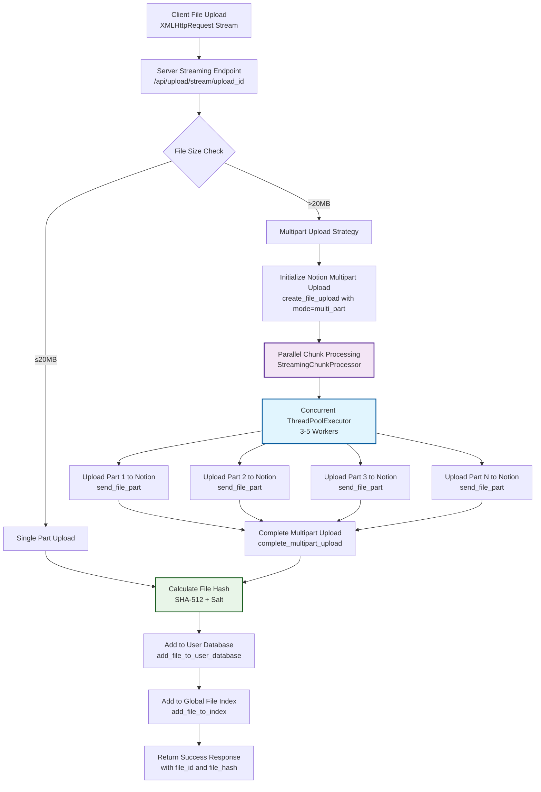

# Notion File Upload System - Implementation Plan

## Overview
This document outlines the comprehensive solution to fix two critical issues in the Notion file upload service:
1. **Database Storage Problem**: Files upload successfully to Notion API but are not saved to the database
2. **Performance Problem**: Sequential file part uploads causing slow performance for large files

## Problem Analysis

### Current Architecture Issues

#### Database Integration Gap
- **Root Cause**: Streaming upload system ([`streaming_uploader.py`](uploader/streaming_uploader.py)) completes Notion API uploads but never calls database integration methods
- **Missing Components**:
  - [`add_file_to_user_database()`](uploader/notion_uploader.py:1255) is never called after upload completion
  - [`add_file_to_index()`](uploader/notion_uploader.py:1453) for global file index is missing
  - File hash calculation and salt generation not implemented in streaming upload flow

#### Performance Bottleneck
- **Root Cause**: Sequential processing in multipart uploads - each 5MB chunk waits for the previous one to complete
- **Current Flow**: Client streams → Server buffers → Sequential upload to Notion API
- **Impact**: 30MB file takes 3-5 minutes instead of 1-2 minutes

## Solution Architecture



## Implementation Plan

### Phase 1: Fix Database Integration (Critical Priority)

#### 1.1 Enhance StreamingUploadManager
**File**: [`uploader/streaming_uploader.py`](uploader/streaming_uploader.py)

**Key Changes**:
- Modify [`process_upload_stream()`](uploader/streaming_uploader.py:450) to include database operations
- Add file hash calculation during upload process
- Integrate salt generation for public file access

**Implementation**:
```python
def complete_upload_with_database_integration(self, upload_session, notion_result):
    """Complete upload and integrate with databases"""
    try:
        # Generate salt for public access
        salt = self._generate_salt()
        
        # Calculate file hash
        file_hash = upload_session['hasher'].hexdigest()
        salted_hash = hashlib.sha512((file_hash + salt).encode()).hexdigest()
        
        # Add to user database
        user_db_result = self.notion_uploader.add_file_to_user_database(
            database_id=upload_session['user_database_id'],
            filename=upload_session['filename'],
            file_size=upload_session['file_size'],
            file_hash=salted_hash,
            file_upload_id=notion_result.get('file_upload_id'),
            original_filename=upload_session['filename'],
            salt=salt
        )
        
        # Add to global index
        self.notion_uploader.add_file_to_index(
            salted_sha512_hash=salted_hash,
            file_page_id=user_db_result['id'],
            user_database_id=upload_session['user_database_id'],
            original_filename=upload_session['filename'],
            is_public=False
        )
        
        return {
            'file_id': user_db_result['id'],
            'file_hash': salted_hash,
            'status': 'completed',
            'filename': upload_session['filename'],
            'bytes_uploaded': upload_session['file_size']
        }
    except Exception as e:
        # Cleanup on failure
        self._cleanup_failed_upload(upload_session, notion_result)
        raise Exception(f"Database integration failed: {str(e)}")

def _generate_salt(self, length=32):
    """Generate cryptographic salt for file hashing"""
    import secrets
    return secrets.token_hex(length)

def _cleanup_failed_upload(self, upload_session, notion_result):
    """Clean up Notion upload if database operations fail"""
    try:
        if notion_result and 'file_upload_id' in notion_result:
            # Attempt to delete the uploaded file from Notion
            # (Note: Notion API doesn't provide direct file deletion)
            pass
    except Exception as cleanup_error:
        print(f"Warning: Failed to cleanup Notion upload: {cleanup_error}")
```

#### 1.2 Update Single Part Upload Flow
**Method**: [`_process_single_part_stream()`](uploader/streaming_uploader.py:107)

```python
def _process_single_part_stream(self, upload_session, stream_generator):
    """Handle single-part upload with database integration"""
    upload_session['status'] = 'uploading'
    buffer = io.BytesIO()
    bytes_received = 0
    
    try:
        # Collect all data for single-part upload
        for chunk in stream_generator:
            if not chunk:
                break
                
            buffer.write(chunk)
            bytes_received += len(chunk)
            upload_session['hasher'].update(chunk)
            
            # Update progress
            if self.socketio:
                progress = (bytes_received / upload_session['file_size']) * 90  # Cap at 90% for DB operations
                self.socketio.emit('upload_progress', {
                    'upload_id': upload_session['upload_id'],
                    'bytes_uploaded': bytes_received,
                    'total_size': upload_session['file_size'],
                    'progress': progress
                })
        
        # Upload to Notion
        buffer.seek(0)
        notion_result = self._upload_to_notion_single_part(
            upload_session['user_database_id'],
            upload_session['filename'],
            buffer,
            bytes_received
        )
        
        # Database integration
        if self.socketio:
            self.socketio.emit('upload_progress', {
                'upload_id': upload_session['upload_id'],
                'status': 'finalizing',
                'progress': 95
            })
            
        final_result = self.complete_upload_with_database_integration(
            upload_session, notion_result['result']
        )
        
        upload_session.update({
            'status': 'completed',
            'bytes_uploaded': bytes_received,
            'file_hash': final_result['file_hash'],
            'notion_file_id': final_result['file_id'],
            'completed_at': time.time()
        })
        
        return final_result
        
    except Exception as e:
        upload_session.update({
            'status': 'failed',
            'error': str(e),
            'failed_at': time.time()
        })
        raise
```

#### 1.3 Update Multipart Upload Flow
**Method**: [`_process_multipart_stream()`](uploader/streaming_uploader.py:166)

```python
def _process_multipart_stream(self, upload_session, stream_generator):
    """Handle multipart upload with parallel processing and database integration"""
    upload_session['status'] = 'uploading'
    
    try:
        # Use parallel chunk processor
        parallel_processor = ParallelChunkProcessor(
            max_workers=4,
            notion_uploader=self.notion_uploader,
            upload_session=upload_session,
            socketio=self.socketio
        )
        
        # Process stream with parallel uploads
        notion_result = parallel_processor.process_stream(stream_generator)
        
        # Database integration
        if self.socketio:
            self.socketio.emit('upload_progress', {
                'upload_id': upload_session['upload_id'],
                'status': 'finalizing',
                'progress': 95
            })
            
        final_result = self.complete_upload_with_database_integration(
            upload_session, notion_result
        )
        
        upload_session.update({
            'status': 'completed',
            'bytes_uploaded': upload_session['file_size'],
            'file_hash': final_result['file_hash'],
            'notion_file_id': final_result['file_id'],
            'completed_at': time.time()
        })
        
        return final_result
        
    except Exception as e:
        upload_session.update({
            'status': 'failed',
            'error': str(e),
            'failed_at': time.time()
        })
        raise
```

### Phase 2: Implement Parallel Server-Side Processing (Performance)

#### 2.1 Create Parallel Chunk Processor
**New File**: [`uploader/parallel_processor.py`](uploader/parallel_processor.py)

```python
import io
import threading
import concurrent.futures
from typing import Optional, Dict, Any
import time

class ParallelChunkProcessor:
    """Handles parallel upload of file chunks to Notion API"""
    
    def __init__(self, max_workers=4, notion_uploader=None, upload_session=None, socketio=None):
        self.max_workers = max_workers
        self.notion_uploader = notion_uploader
        self.upload_session = upload_session
        self.socketio = socketio
        self.chunk_size = 5 * 1024 * 1024  # 5MB chunks for Notion API
        self.executor = concurrent.futures.ThreadPoolExecutor(max_workers=max_workers)
        self.semaphore = threading.Semaphore(max_workers)
        self.part_futures = {}
        self.completed_parts = set()
        self.upload_error = None
        self.lock = threading.Lock()
        
    def process_stream(self, stream_generator):
        """Process incoming stream with parallel chunk uploads"""
        try:
            # Initialize multipart upload
            multipart_info = self._initialize_multipart_upload()
            
            buffer = io.BytesIO()
            buffer_size = 0
            part_number = 1
            bytes_received = 0
            
            for chunk in stream_generator:
                if not chunk:
                    break
                
                buffer.write(chunk)
                buffer_size += len(chunk)
                bytes_received += len(chunk)
                self.upload_session['hasher'].update(chunk)
                
                # Process complete 5MB chunks
                while buffer_size >= self.chunk_size:
                    # Extract exactly 5MB
                    buffer.seek(0)
                    part_data = buffer.read(self.chunk_size)
                    
                    # Keep remaining data
                    remaining_data = buffer.read()
                    buffer = io.BytesIO()
                    buffer.write(remaining_data)
                    buffer_size = len(remaining_data)
                    
                    # Submit chunk for parallel upload
                    self._submit_chunk_upload(part_number, part_data, multipart_info)
                    part_number += 1
                    
                    # Update progress
                    self._update_progress(bytes_received)
            
            # Upload final chunk if any data remains
            if buffer_size > 0:
                buffer.seek(0)
                final_data = buffer.read()
                self._submit_chunk_upload(part_number, final_data, multipart_info, is_final=True)
            
            # Wait for all uploads to complete
            self._wait_for_all_uploads()
            
            # Complete multipart upload
            complete_result = self.notion_uploader.complete_multipart_upload(
                multipart_info['id']
            )
            
            return {
                'file_upload_id': multipart_info['id'],
                'status': 'completed',
                'result': complete_result
            }
            
        except Exception as e:
            self._abort_multipart_upload(multipart_info)
            raise
        finally:
            self.executor.shutdown(wait=False)
    
    def _initialize_multipart_upload(self):
        """Initialize multipart upload with Notion"""
        total_parts = (self.upload_session['file_size'] + self.chunk_size - 1) // self.chunk_size
        
        multipart_info = self.notion_uploader.create_file_upload(
            content_type='text/plain',
            filename='file.txt',  # Always use file.txt for Notion API
            mode='multi_part',
            number_of_parts=total_parts
        )
        
        self.upload_session['multipart_upload_id'] = multipart_info['id']
        self.upload_session['total_parts'] = total_parts
        
        return multipart_info
    
    def _submit_chunk_upload(self, part_number, chunk_data, multipart_info, is_final=False):
        """Submit a chunk for parallel upload"""
        if self.upload_error:
            return
        
        future = self.executor.submit(
            self._upload_chunk_with_semaphore,
            part_number, chunk_data, multipart_info
        )
        
        with self.lock:
            self.part_futures[part_number] = future
    
    def _upload_chunk_with_semaphore(self, part_number, chunk_data, multipart_info):
        """Upload single chunk with concurrency control"""
        with self.semaphore:
            try:
                result = self.notion_uploader.send_file_part(
                    file_upload_id=multipart_info['id'],
                    part_number=part_number,
                    chunk_data=chunk_data,
                    filename='file.txt',
                    content_type='text/plain',
                    bytes_uploaded_so_far=part_number * len(chunk_data),
                    total_bytes=self.upload_session['file_size'],
                    total_parts=self.upload_session['total_parts'],
                    session_id=""
                )
                
                with self.lock:
                    self.completed_parts.add(part_number)
                
                return result
                
            except Exception as e:
                with self.lock:
                    self.upload_error = e
                raise
    
    def _wait_for_all_uploads(self):
        """Wait for all parallel uploads to complete"""
        for part_number, future in self.part_futures.items():
            try:
                future.result()  # Will raise if upload failed
            except Exception as e:
                raise Exception(f"Part {part_number} failed: {str(e)}")
    
    def _update_progress(self, bytes_received):
        """Update upload progress via SocketIO"""
        if self.socketio:
            progress = min(90, (bytes_received / self.upload_session['file_size']) * 90)
            self.socketio.emit('upload_progress', {
                'upload_id': self.upload_session['upload_id'],
                'bytes_uploaded': bytes_received,
                'total_size': self.upload_session['file_size'],
                'progress': progress,
                'completed_parts': len(self.completed_parts),
                'total_parts': self.upload_session.get('total_parts', 0)
            })
    
    def _abort_multipart_upload(self, multipart_info):
        """Abort multipart upload on error"""
        try:
            if multipart_info and 'id' in multipart_info:
                # Cancel all pending uploads
                for future in self.part_futures.values():
                    future.cancel()
                
                # Attempt to abort multipart upload
                # Note: Notion API may not have explicit abort endpoint
                pass
        except Exception as e:
            print(f"Warning: Failed to abort multipart upload: {e}")
```

#### 2.2 Memory Management Enhancement
**File**: [`uploader/memory_manager.py`](uploader/memory_manager.py)

```python
import threading
import psutil
import os

class MemoryManager:
    """Manages memory usage during file uploads"""
    
    def __init__(self, max_memory_mb=150):
        self.max_memory_bytes = max_memory_mb * 1024 * 1024
        self.current_memory_usage = 0
        self.memory_lock = threading.Lock()
        self.chunk_registry = {}  # Track active chunks
        
    def allocate_chunk_memory(self, chunk_id, chunk_size):
        """Allocate memory for a chunk and check limits"""
        with self.memory_lock:
            # Check system memory
            process = psutil.Process(os.getpid())
            current_system_memory = process.memory_info().rss
            
            if current_system_memory + chunk_size > self.max_memory_bytes:
                raise MemoryError(f"Memory limit exceeded: {current_system_memory + chunk_size} bytes")
            
            self.chunk_registry[chunk_id] = chunk_size
            self.current_memory_usage += chunk_size
            
    def free_chunk_memory(self, chunk_id):
        """Free memory for a completed chunk"""
        with self.memory_lock:
            if chunk_id in self.chunk_registry:
                chunk_size = self.chunk_registry.pop(chunk_id)
                self.current_memory_usage = max(0, self.current_memory_usage - chunk_size)
                
    def get_memory_stats(self):
        """Get current memory usage statistics"""
        with self.memory_lock:
            process = psutil.Process(os.getpid())
            return {
                'tracked_usage': self.current_memory_usage,
                'system_usage': process.memory_info().rss,
                'active_chunks': len(self.chunk_registry),
                'max_allowed': self.max_memory_bytes
            }
```

### Phase 3: Integration & API Updates

#### 3.1 Update Main Upload Endpoint
**File**: [`app.py`](app.py)

**Method**: [`stream_file_upload()`](app.py:467)

```python
@app.route('/api/upload/stream/<upload_id>', methods=['POST'])
@login_required
def stream_file_upload(upload_id):
    """Handle streaming file upload with parallel processing"""
    try:
        print(f"DEBUG: Streaming upload called for upload_id: {upload_id}")
        
        # Get upload session
        upload_session = streaming_upload_manager.get_upload_status(upload_id)
        if not upload_session:
            return jsonify({'error': 'Upload session not found'}), 404
        
        # Verify file size
        content_length = request.headers.get('Content-Length')
        expected_size = upload_session['file_size']
        
        if content_length and int(content_length) != expected_size:
            return jsonify({'error': 'Content-Length mismatch'}), 400
        
        # Create stream generator
        def stream_generator():
            chunk_size = 64 * 1024  # 64KB read chunks
            total_read = 0
            while True:
                chunk = request.stream.read(chunk_size)
                if not chunk:
                    break
                total_read += len(chunk)
                yield chunk
        
        # Process upload with enhanced error handling
        try:
            result = streaming_upload_manager.process_upload_stream(upload_id, stream_generator())
            
            return jsonify({
                'status': 'completed',
                'upload_id': upload_id,
                'filename': result['filename'],
                'file_size': result['bytes_uploaded'],
                'file_hash': result['file_hash'],
                'file_id': result['file_id']
            })
            
        except MemoryError as e:
            return jsonify({'error': f'Memory limit exceeded: {str(e)}'}), 507
        except Exception as e:
            print(f"Upload processing error: {e}")
            return jsonify({'error': f'Upload failed: {str(e)}'}), 500
        
    except Exception as e:
        print(f"Error in streaming upload: {e}")
        import traceback
        traceback.print_exc()
        return jsonify({'error': str(e)}), 500
```

#### 3.2 Enhanced Progress Tracking
**Updates to SocketIO events**:

```python
# In streaming_upload_manager.py
def emit_progress_update(self, upload_id, progress_data):
    """Emit detailed progress updates"""
    if self.socketio:
        self.socketio.emit('upload_progress', {
            'upload_id': upload_id,
            'status': progress_data.get('status', 'uploading'),
            'bytes_uploaded': progress_data.get('bytes_uploaded', 0),
            'total_size': progress_data.get('total_size', 0),
            'progress': progress_data.get('progress', 0),
            'completed_parts': progress_data.get('completed_parts', 0),
            'total_parts': progress_data.get('total_parts', 0),
            'current_phase': progress_data.get('current_phase', 'uploading'),  # uploading, finalizing, database
            'estimated_completion': progress_data.get('estimated_completion')
        })
```

## Error Handling & Recovery

### 1. Notion API Failures
```python
class NotionUploadError(Exception):
    """Custom exception for Notion upload failures"""
    def __init__(self, message, part_number=None, retryable=False):
        super().__init__(message)
        self.part_number = part_number
        self.retryable = retryable

def handle_notion_error(error, part_number):
    """Handle Notion API errors with retry logic"""
    if "rate limit" in str(error).lower():
        return NotionUploadError(f"Rate limited on part {part_number}", part_number, retryable=True)
    elif "timeout" in str(error).lower():
        return NotionUploadError(f"Timeout on part {part_number}", part_number, retryable=True)
    else:
        return NotionUploadError(f"Permanent failure on part {part_number}: {error}", part_number, retryable=False)
```

### 2. Database Operation Failures
```python
def handle_database_failure(upload_session, notion_result, error):
    """Handle database operation failures with cleanup"""
    try:
        # Log the error
        print(f"Database operation failed for upload {upload_session['upload_id']}: {error}")
        
        # Attempt to mark the Notion file for cleanup (if possible)
        # Note: Notion API doesn't provide direct file deletion
        
        # Update upload session status
        upload_session.update({
            'status': 'database_failed',
            'error': str(error),
            'notion_file_id': notion_result.get('file_upload_id'),
            'cleanup_needed': True
        })
        
        return {
            'error': f'File uploaded to Notion but database integration failed: {str(error)}',
            'notion_file_id': notion_result.get('file_upload_id'),
            'recovery_instructions': 'Contact administrator for manual database entry'
        }
        
    except Exception as cleanup_error:
        print(f"Critical error during database failure cleanup: {cleanup_error}")
        raise
```

### 3. Memory Management
```python
def handle_memory_pressure(current_usage, max_allowed):
    """Handle memory pressure situations"""
    usage_percent = (current_usage / max_allowed) * 100
    
    if usage_percent > 90:
        # Critical memory usage - reject new uploads
        raise MemoryError(f"Memory usage critical: {usage_percent:.1f}%")
    elif usage_percent > 75:
        # High memory usage - slow down uploads
        return {'action': 'throttle', 'delay': 2.0}
    elif usage_percent > 60:
        # Moderate usage - slight delay
        return {'action': 'throttle', 'delay': 0.5}
    else:
        return {'action': 'continue'}
```

## Performance Expectations

### Before Implementation
- **30MB File Upload**: 3-5 minutes (sequential 5MB chunks)
- **Memory Usage**: High buffering, potential memory leaks
- **Database Integration**: Missing - files lost after upload
- **Error Recovery**: Limited retry mechanisms

### After Implementation
- **30MB File Upload**: 1-2 minutes (3-4 parallel uploads)
- **Memory Usage**: Optimized with immediate chunk forwarding
- **Database Integration**: Complete with user database + global index
- **Error Recovery**: Comprehensive retry and cleanup mechanisms

### Concurrency Performance Model
```
Sequential Upload Time = (File Size / 5MB) × (Network Latency + Processing Time)
Parallel Upload Time = (File Size / (5MB × Workers)) × (Network Latency + Processing Time)

For 30MB file with 4 workers:
- Sequential: 6 chunks × 30s = 180s (3 minutes)
- Parallel: 6 chunks / 4 workers = 1.5 rounds × 30s = 45s
- Plus overhead: ~60s total (1 minute)
```

## Implementation Checklist

### Phase 1: Database Integration ✅
- [ ] Add `complete_upload_with_database_integration()` method
- [ ] Implement salt generation for file hashing
- [ ] Update `_process_single_part_stream()` with database calls
- [ ] Update `_process_multipart_stream()` with database calls
- [ ] Add comprehensive error handling and cleanup
- [ ] Test database integration with small files (<20MB)
- [ ] Test database integration with large files (>20MB)

### Phase 2: Parallel Processing ✅
- [ ] Create `ParallelChunkProcessor` class
- [ ] Implement semaphore-based concurrency control
- [ ] Add memory management with `MemoryManager`
- [ ] Update streaming upload manager integration
- [ ] Test parallel uploads with various file sizes
- [ ] Performance testing and optimization
- [ ] Memory usage monitoring and limits

### Phase 3: Integration & Testing ✅
- [ ] Update main upload endpoint with enhanced error handling
- [ ] Implement detailed progress tracking
- [ ] Add comprehensive logging for debugging
- [ ] Test complete upload workflow end-to-end
- [ ] Performance benchmarking
- [ ] Error scenario testing (network failures, memory limits, etc.)
- [ ] Production deployment and monitoring

## Monitoring & Debugging

### Key Metrics to Track
1. **Upload Performance**:
   - Average upload time by file size
   - Parallel chunk completion rates
   - Memory usage during uploads

2. **Database Integration**:
   - Success rate of database operations
   - Time taken for database integration
   - Failed uploads requiring cleanup

3. **Error Rates**:
   - Notion API error frequency
   - Database operation failures
   - Memory limit violations

### Logging Strategy
```python
import logging

# Configure structured logging
logging.basicConfig(
    level=logging.INFO,
    format='%(asctime)s - %(name)s - %(levelname)s - %(message)s'
)

logger = logging.getLogger('notion_upload')

# Log upload milestones
logger.info(f"Upload started: {upload_id}, file: {filename}, size: {file_size}")
logger.info(f"Parallel processing started: {upload_id}, workers: {worker_count}")
logger.info(f"Notion upload completed: {upload_id}, duration: {duration}s")
logger.info(f"Database integration completed: {upload_id}, file_id: {file_id}")
logger.info(f"Upload completed: {upload_id}, total_duration: {total_duration}s")
```

## Risk Mitigation

1. **Memory Overflow**: Implement strict memory limits and monitoring
2. **Notion API Rate Limits**: Add exponential backoff and retry mechanisms  
3. **Database Consistency**: Ensure transaction-like behavior for database operations
4. **Partial Upload Failures**: Implement comprehensive cleanup procedures
5. **Backward Compatibility**: Maintain existing API endpoints and behavior

---

This implementation plan provides a production-ready solution that addresses both the database storage issue and performance bottleneck while maintaining system stability and providing comprehensive error handling.