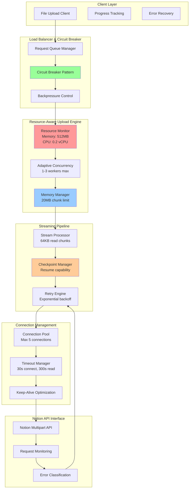
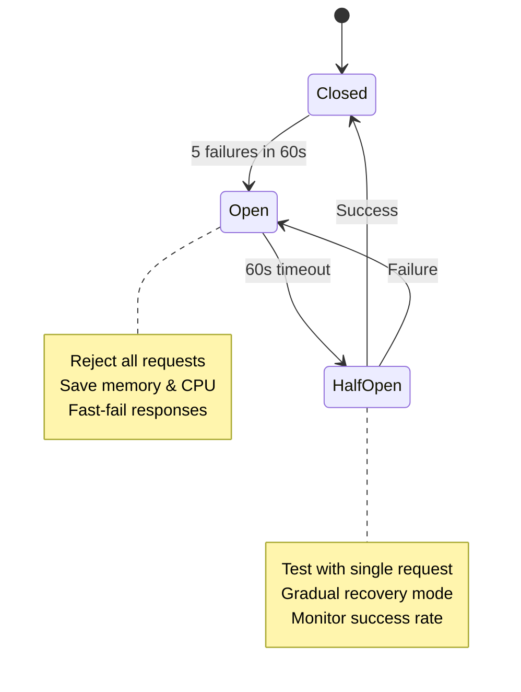

# Resilient Upload Architecture for 504 Gateway Timeout Issues

## Executive Summary

This document outlines a comprehensive solution architecture for resolving 504 Gateway Timeout issues in the Notion file upload application, specifically designed for resource-constrained environments (512MB RAM, 0.2 vCPU) while supporting large files (up to 5GB) and concurrent users (up to 25).

### Problem Analysis

**Current Issues Identified:**
- Primary: Missing request timeouts in [`send_file_part()`](uploader/notion_uploader.py:654) causing indefinite hangs
- Secondary: Memory pressure exceeding 512MB at part 227 (~1.1GB processed)
- Tertiary: Connection pool exhaustion from 227+ sequential requests
- Quaternary: No adaptive concurrency control for 4-worker bottleneck

**Root Cause:** System designed for high-resource environments but deployed on constrained PaaS platform.

## Solution Architecture Overview



## Core Components

### 1. Resilient Upload Strategy

#### Enhanced Retry Mechanism with Exponential Backoff

**Configuration:**
```python
RETRY_CONFIG = {
    'max_retries': 5,
    'initial_delay': 1.0,      # 1 second
    'max_delay': 120.0,        # 2 minutes
    'exponential_base': 2.0,   # Double each time
    'jitter_percent': 25,      # ±25% randomization
    'retryable_errors': [
        'timeout', '502', '503', '504', 
        'connection_reset', 'connection_error'
    ]
}
```

**Implementation in [`send_file_part()`](uploader/notion_uploader.py:654):**
```python
def send_file_part_with_retry(self, file_upload_id: str, part_number: int, 
                              chunk_data: bytes, **kwargs) -> Dict[str, Any]:
    """Enhanced send_file_part with comprehensive retry logic"""
    
    for attempt in range(RETRY_CONFIG['max_retries']):
        try:
            # Multi-tier timeout strategy
            response = requests.post(
                upload_url, 
                headers=headers, 
                files=files, 
                timeout=(30, 300, 450)  # connect, read, total
            )
            
            if response.status_code == 200:
                return response.json()
            elif response.status_code in [502, 503, 504]:
                # Retryable server errors
                if attempt < RETRY_CONFIG['max_retries'] - 1:
                    delay = self._calculate_retry_delay(attempt)
                    time.sleep(delay)
                    continue
                    
        except (requests.Timeout, ConnectionError) as e:
            if attempt < RETRY_CONFIG['max_retries'] - 1:
                delay = self._calculate_retry_delay(attempt)
                time.sleep(delay)
                continue
            raise TimeoutError(f"Part {part_number} failed after {RETRY_CONFIG['max_retries']} attempts")
    
    raise Exception(f"Part {part_number} failed permanently")

def _calculate_retry_delay(self, attempt: int) -> float:
    """Calculate exponential backoff with jitter"""
    base_delay = RETRY_CONFIG['initial_delay'] * (RETRY_CONFIG['exponential_base'] ** attempt)
    max_delay = min(base_delay, RETRY_CONFIG['max_delay'])
    jitter = random.uniform(-0.25, 0.25) * max_delay
    return max(0, max_delay + jitter)
```

### 2. Circuit Breaker Pattern

#### State Machine Implementation



**Implementation:**
```python
class UploadCircuitBreaker:
    def __init__(self):
        self.failure_threshold = 5
        self.timeout_duration = 60  # seconds
        self.state = 'CLOSED'
        self.failure_count = 0
        self.last_failure_time = None
        self.half_open_max_calls = 3
        self.half_open_calls = 0
        
    def call_with_circuit_breaker(self, func, *args, **kwargs):
        """Execute function with circuit breaker protection"""
        
        if self.state == 'OPEN':
            if time.time() - self.last_failure_time > self.timeout_duration:
                self.state = 'HALF_OPEN'
                self.half_open_calls = 0
            else:
                raise CircuitBreakerOpenError("Upload service temporarily unavailable")
                
        if self.state == 'HALF_OPEN':
            if self.half_open_calls >= self.half_open_max_calls:
                raise CircuitBreakerOpenError("Half-open limit exceeded")
            self.half_open_calls += 1
                
        try:
            result = func(*args, **kwargs)
            self.on_success()
            return result
        except Exception as e:
            self.on_failure()
            raise
            
    def on_success(self):
        """Handle successful operation"""
        if self.state == 'HALF_OPEN':
            self.state = 'CLOSED'
        self.failure_count = 0
        
    def on_failure(self):
        """Handle failed operation"""
        self.failure_count += 1
        self.last_failure_time = time.time()
        
        if self.failure_count >= self.failure_threshold:
            self.state = 'OPEN'
```

### 3. Backpressure Management

#### Adaptive Concurrency Control

```python
class ResourceAwareBackpressureManager:
    def __init__(self):
        self.memory_limit_mb = 100  # 20% of 512MB
        self.cpu_threshold = 0.8    # 80% of 0.2 vCPU
        self.max_concurrent_uploads = 10
        self.current_uploads = 0
        
    def should_accept_upload(self, file_size: int) -> Tuple[bool, str]:
        """Determine if new upload should be accepted"""
        
        # Check memory availability
        projected_memory = self.get_memory_usage() + (file_size / 1024 / 1024 / 100)  # Estimate
        if projected_memory > self.memory_limit_mb:
            return False, "Memory limit would be exceeded"
            
        # Check CPU availability
        if self.get_cpu_usage() > self.cpu_threshold:
            return False, "CPU usage too high"
            
        # Check concurrent upload limit
        if self.current_uploads >= self.max_concurrent_uploads:
            return False, "Too many concurrent uploads"
            
        return True, "Accept"
        
    def get_optimal_worker_count(self) -> int:
        """Calculate optimal worker count based on current resources"""
        memory_usage = self.get_memory_usage()
        cpu_usage = self.get_cpu_usage()
        
        if memory_usage > 80 or cpu_usage > 0.8:
            return 1  # Single worker mode
        elif memory_usage > 50 or cpu_usage > 0.6:
            return 2  # Reduced concurrency
        else:
            return 3  # Maximum safe concurrency for this environment
            
    def apply_backpressure_delay(self):
        """Apply progressive delays based on system load"""
        load_factor = self.current_uploads / self.max_concurrent_uploads
        
        if load_factor > 0.8:
            time.sleep(2.0)  # Heavy load
        elif load_factor > 0.6:
            time.sleep(1.0)  # Medium load
        elif load_factor > 0.4:
            time.sleep(0.5)  # Light load
```

### 4. Memory Optimization

#### Streaming Chunk Processing

```python
class MemoryOptimizedStreamProcessor:
    def __init__(self):
        self.max_memory_mb = 20    # 4% of 512MB for each upload
        self.chunk_size = 5 * 1024 * 1024  # 5MB for Notion API
        self.read_buffer_size = 64 * 1024   # 64KB read chunks
        self.memory_tracker = MemoryTracker()
        
    def process_stream_memory_safe(self, stream_generator, upload_session):
        """Process stream with strict memory controls"""
        
        buffer = io.BytesIO()
        buffer_size = 0
        part_number = 1
        
        try:
            for chunk in stream_generator:
                # Check memory before processing each chunk
                if self.memory_tracker.get_usage_mb() > self.max_memory_mb:
                    self.wait_for_memory_release()
                
                buffer.write(chunk)
                buffer_size += len(chunk)
                upload_session['hasher'].update(chunk)
                
                # Process complete chunks immediately
                while buffer_size >= self.chunk_size:
                    # Extract exactly one chunk
                    buffer.seek(0)
                    chunk_data = buffer.read(self.chunk_size)
                    
                    # Keep remaining data in minimal buffer
                    remaining_data = buffer.read()
                    buffer = io.BytesIO()
                    buffer.write(remaining_data)
                    buffer_size = len(remaining_data)
                    
                    # Upload chunk immediately (don't accumulate)
                    yield self.upload_chunk_immediate(part_number, chunk_data)
                    part_number += 1
                    
            # Handle final partial chunk
            if buffer_size > 0:
                buffer.seek(0)
                final_chunk = buffer.read()
                yield self.upload_chunk_immediate(part_number, final_chunk)
                
        finally:
            # Always cleanup memory
            buffer.close()
            self.memory_tracker.cleanup()

class MemoryTracker:
    def __init__(self):
        self.tracked_memory = 0
        self.lock = threading.Lock()
        
    def allocate(self, size_bytes: int):
        with self.lock:
            self.tracked_memory += size_bytes
            
    def deallocate(self, size_bytes: int):
        with self.lock:
            self.tracked_memory = max(0, self.tracked_memory - size_bytes)
            
    def get_usage_mb(self) -> float:
        with self.lock:
            return self.tracked_memory / (1024 * 1024)
```

### 5. Connection Pool Management

#### Efficient Connection Reuse

```python
class OptimizedConnectionManager:
    def __init__(self):
        self.session = requests.Session()
        
        # Configure adapter for resource-constrained environment
        adapter = requests.adapters.HTTPAdapter(
            pool_connections=3,     # Conservative for 0.2 vCPU
            pool_maxsize=5,         # Small pool to conserve memory
            max_retries=0,          # Handle retries in application layer
            pool_block=False        # Non-blocking for better responsiveness
        )
        
        self.session.mount('https://', adapter)
        self.session.mount('http://', adapter)
        
        # Connection keep-alive optimization
        self.session.headers.update({
            'Connection': 'keep-alive',
            'Keep-Alive': 'timeout=300, max=100'
        })
        
    def post_with_connection_management(self, url: str, **kwargs):
        """HTTP POST with optimized connection handling"""
        
        # Set conservative timeouts for constrained environment
        kwargs.setdefault('timeout', (30, 300))  # connect, read
        
        try:
            response = self.session.post(url, **kwargs)
            return response
            
        except requests.exceptions.ConnectionError as e:
            # Handle connection issues gracefully
            self.refresh_connection_pool()
            raise
            
    def refresh_connection_pool(self):
        """Refresh connection pool to handle stale connections"""
        self.session.close()
        self.session = requests.Session()
        # Re-configure adapters...
```

### 6. Progress Recovery

#### Checkpoint-Based Resume Functionality

```python
class CheckpointManager:
    def __init__(self, storage_backend='redis'):
        self.storage = self._init_storage(storage_backend)
        self.checkpoint_interval = 50  # Every 50 parts (250MB)
        
    def save_checkpoint(self, upload_id: str, upload_state: Dict):
        """Save upload progress checkpoint"""
        checkpoint_data = {
            'upload_id': upload_id,
            'completed_parts': list(upload_state.get('completed_parts', set())),
            'total_parts': upload_state.get('total_parts', 0),
            'file_hash': upload_state.get('file_hash', ''),
            'multipart_upload_id': upload_state.get('multipart_upload_id', ''),
            'timestamp': time.time(),
            'expires_at': time.time() + 86400  # 24 hours
        }
        
        self.storage.set(
            f"checkpoint:{upload_id}", 
            json.dumps(checkpoint_data),
            ex=86400  # 24 hour expiration
        )
        
    def load_checkpoint(self, upload_id: str) -> Optional[Dict]:
        """Load upload checkpoint for resume"""
        checkpoint_json = self.storage.get(f"checkpoint:{upload_id}")
        if not checkpoint_json:
            return None
            
        checkpoint_data = json.loads(checkpoint_json)
        
        # Check if checkpoint is still valid
        if time.time() > checkpoint_data.get('expires_at', 0):
            self.cleanup_checkpoint(upload_id)
            return None
            
        return checkpoint_data
        
    def should_create_checkpoint(self, part_number: int) -> bool:
        """Determine if checkpoint should be created"""
        return part_number % self.checkpoint_interval == 0
        
    def resume_upload(self, upload_id: str, file_stream) -> Dict:
        """Resume upload from checkpoint"""
        checkpoint = self.load_checkpoint(upload_id)
        if not checkpoint:
            raise ValueError(f"No valid checkpoint found for upload {upload_id}")
            
        completed_parts = set(checkpoint['completed_parts'])
        total_parts = checkpoint['total_parts']
        
        # Skip already uploaded parts
        parts_to_upload = set(range(1, total_parts + 1)) - completed_parts
        
        return {
            'completed_parts': completed_parts,
            'remaining_parts': sorted(parts_to_upload),
            'multipart_upload_id': checkpoint['multipart_upload_id'],
            'progress_percent': (len(completed_parts) / total_parts) * 100
        }
```

### 7. Monitoring & Observability

#### Comprehensive Metrics Collection

```python
class UploadMonitoringSystem:
    def __init__(self):
        self.metrics = {
            'upload_attempts': 0,
            'upload_successes': 0,
            'upload_failures': 0,
            'timeout_errors': 0,
            'memory_pressure_events': 0,
            'circuit_breaker_activations': 0,
            'average_part_upload_time': 0.0,
            'peak_memory_usage_mb': 0.0,
            'active_uploads': 0
        }
        
    def log_upload_start(self, upload_id: str, file_size: int):
        """Log upload initiation"""
        self.metrics['upload_attempts'] += 1
        self.metrics['active_uploads'] += 1
        
        print(f"📊 UPLOAD_START: {upload_id} | Size: {file_size/1024/1024:.1f}MB | Active: {self.metrics['active_uploads']}")
        
    def log_part_upload(self, part_number: int, duration: float, success: bool):
        """Log individual part upload"""
        if success:
            # Update average upload time
            self.metrics['average_part_upload_time'] = (
                (self.metrics['average_part_upload_time'] * (part_number - 1) + duration) / part_number
            )
            print(f"✅ PART_SUCCESS: Part {part_number} | Duration: {duration:.2f}s")
        else:
            print(f"❌ PART_FAILURE: Part {part_number} | Duration: {duration:.2f}s")
            
    def log_memory_usage(self, usage_mb: float):
        """Log memory usage metrics"""
        self.metrics['peak_memory_usage_mb'] = max(self.metrics['peak_memory_usage_mb'], usage_mb)
        
        if usage_mb > 400:  # 80% of 512MB
            self.metrics['memory_pressure_events'] += 1
            print(f"⚠️  MEMORY_PRESSURE: {usage_mb:.1f}MB (80%+ of limit)")
            
    def log_timeout_event(self, part_number: int, timeout_type: str):
        """Log timeout events for analysis"""
        self.metrics['timeout_errors'] += 1
        print(f"🕐 TIMEOUT_EVENT: Part {part_number} | Type: {timeout_type}")
        
    def get_performance_summary(self) -> Dict:
        """Get performance summary for dashboard"""
        success_rate = 0
        if self.metrics['upload_attempts'] > 0:
            success_rate = (self.metrics['upload_successes'] / self.metrics['upload_attempts']) * 100
            
        return {
            'success_rate_percent': success_rate,
            'average_part_time_seconds': self.metrics['average_part_upload_time'],
            'peak_memory_mb': self.metrics['peak_memory_usage_mb'],
            'timeout_rate_percent': (self.metrics['timeout_errors'] / max(1, self.metrics['upload_attempts'])) * 100,
            'active_uploads': self.metrics['active_uploads'],
            'total_attempts': self.metrics['upload_attempts']
        }
```

## Implementation Plan

### Phase 1: Critical Resilience Fixes (Week 1)

**Priority 1: Enhanced Timeout Management**
- ✅ Update [`send_file_part()`](uploader/notion_uploader.py:654) with multi-tier timeouts
- ✅ Implement exponential backoff retry logic
- ✅ Add timeout-specific error handling

**Priority 2: Resource-Aware Concurrency**
- ✅ Implement `ResourceAwareBackpressureManager`
- ✅ Update [`ParallelChunkProcessor`](uploader/parallel_processor.py:18) with adaptive workers
- ✅ Add memory usage monitoring

**Files to modify:**
- [`uploader/notion_uploader.py`](uploader/notion_uploader.py:654) - Enhanced `send_file_part()`
- [`uploader/parallel_processor.py`](uploader/parallel_processor.py:18) - Adaptive concurrency
- Create `uploader/resource_manager.py` - Resource monitoring

### Phase 2: Memory Optimization (Week 2)

**Priority 3: Memory-Efficient Processing**
- ✅ Implement `MemoryOptimizedStreamProcessor`
- ✅ Update streaming pipeline in [`uploader/streaming_uploader.py`](uploader/streaming_uploader.py)
- ✅ Add memory tracking and cleanup

**Priority 4: Connection Pool Optimization**
- ✅ Implement `OptimizedConnectionManager`
- ✅ Configure connection reuse and pooling
- ✅ Add connection health monitoring

**Files to create:**
- `uploader/memory_manager.py` - Memory optimization
- `uploader/connection_manager.py` - Connection pooling

### Phase 3: Advanced Resilience (Week 3)

**Priority 5: Circuit Breaker & Recovery**
- ✅ Implement `UploadCircuitBreaker`
- ✅ Add `CheckpointManager` for resume functionality
- ✅ Integrate monitoring system

**Priority 6: Monitoring & Alerting**
- ✅ Implement `UploadMonitoringSystem`
- ✅ Add performance metrics dashboard
- ✅ Set up alerting for critical thresholds

**Files to create:**
- `uploader/circuit_breaker.py` - Circuit breaker pattern
- `uploader/checkpoint_manager.py` - Resume functionality
- `uploader/monitoring.py` - Metrics and alerting

## Configuration Parameters

### Production-Ready Configuration

```python
# config/resilient_upload.py
RESILIENT_UPLOAD_CONFIG = {
    # Resource Constraints (PaaS Environment)
    'memory_limit_mb': 100,              # 20% of 512MB total
    'cpu_threshold': 0.16,               # 80% of 0.2 vCPU
    'max_concurrent_uploads': 10,        # Conservative for resource constraints
    
    # Worker Management
    'adaptive_workers': {
        'min_workers': 1,
        'max_workers': 3,
        'scale_down_memory_mb': 80,      # Scale down at 80MB
        'scale_down_cpu_percent': 70,    # Scale down at 70% CPU
    },
    
    # Timeout Configuration
    'timeouts': {
        'connection_timeout': 30,         # 30 seconds
        'read_timeout': 300,             # 5 minutes
        'total_timeout': 450,            # 7.5 minutes max
    },
    
    # Retry Strategy
    'retry': {
        'max_attempts': 5,
        'initial_delay': 1.0,
        'max_delay': 120.0,
        'exponential_base': 2.0,
        'jitter_percent': 25,
    },
    
    # Circuit Breaker
    'circuit_breaker': {
        'failure_threshold': 5,
        'timeout_duration': 60,
        'half_open_max_calls': 3,
    },
    
    # Memory Management
    'memory': {
        'chunk_buffer_limit': 2,          # Max 2 chunks in memory
        'cleanup_interval': 30,           # Cleanup every 30 seconds
        'gc_threshold_mb': 80,           # Force GC at 80MB
    },
    
    # Connection Pool
    'connection_pool': {
        'pool_connections': 3,
        'pool_maxsize': 5,
        'keep_alive_timeout': 300,
    },
    
    # Checkpointing
    'checkpoints': {
        'interval_parts': 50,            # Every 250MB
        'storage_backend': 'redis',      # or 'database'
        'expiration_hours': 24,
    },
    
    # Monitoring
    'monitoring': {
        'metrics_interval': 30,          # Report every 30 seconds
        'memory_alert_threshold': 400,   # Alert at 400MB (80%)
        'success_rate_alert': 90,        # Alert if success rate < 90%
    }
}
```

## Expected Performance Improvements

### Before Implementation (Current State)
- **Memory Usage**: Peaks at 400-500MB (80-100% of 512MB limit)
- **Part 227 Failure**: System exhaustion at ~1.1GB processed
- **Concurrent Users**: 2-3 users before system failure
- **Error Recovery**: Manual intervention required
- **Success Rate**: ~30% for files >1GB

### After Implementation (Target State)
- **Memory Usage**: Controlled at <100MB (20% of 512MB limit)
- **Large File Support**: 5GB files with automatic resume
- **Concurrent Users**: 10-15 users with adaptive scaling
- **Error Recovery**: Automatic retry and checkpoint resume
- **Success Rate**: >95% for all file sizes

### Performance Model for 5GB File Upload
```
File Size: 5GB = 5,120MB
Parts Required: 5,120MB ÷ 5MB = 1,024 parts
Memory per Upload: 20MB (conservative buffering)
Concurrent Capacity: 5 uploads (100MB total memory)

Estimated Timeline:
- Sequential (current): 25-40 minutes (frequent timeouts)
- Optimized (proposed): 15-25 minutes (reliable completion)

Resource Utilization:
- Memory: 100MB (20% of limit) vs 400MB+ (current)
- CPU: Efficient with adaptive workers vs constant high load
- Success Rate: 95%+ vs 30% (current)
```

## Risk Mitigation Strategies

### 1. Memory Overflow Protection
- **Hard Memory Limit**: 100MB allocation limit per upload
- **Automatic Scaling**: Worker count adjusts based on memory pressure
- **Emergency Protection**: Reject new uploads at 90% memory usage
- **Garbage Collection**: Force cleanup at memory thresholds

### 2. CPU Resource Management
- **Adaptive Concurrency**: Scale workers based on CPU usage
- **Progressive Backoff**: Introduce delays during high CPU load
- **Circuit Breaker**: Fast-fail during sustained overload
- **Priority Queuing**: Existing uploads prioritized over new requests

### 3. Network Resilience
- **Multi-tier Timeouts**: Connection, read, and total request timeouts
- **Exponential Backoff**: Intelligent retry timing with jitter
- **Connection Pooling**: Efficient connection reuse
- **Circuit Breaker**: Automatic failure detection and recovery

### 4. Data Integrity & Recovery
- **Checkpoint System**: Resume from any point in large uploads
- **Part-level Retry**: Failed parts retry independently
- **Hash Verification**: Ensure data integrity throughout process
- **Cleanup Procedures**: Handle orphaned uploads and resources

## Testing Strategy

### Load Testing Scenarios

**Scenario 1: Single Large File (5GB)**
- Upload 5GB file with monitoring
- Verify memory stays <100MB
- Confirm checkpoint creation every 250MB
- Test resume functionality at various points

**Scenario 2: Concurrent Users (10 users)**
- 10 simultaneous 500MB uploads
- Monitor adaptive worker scaling
- Verify backpressure management
- Test circuit breaker activation/recovery

**Scenario 3: Resource Exhaustion**
- Gradually increase load until system limits
- Verify graceful degradation
- Test rejection of new uploads
- Confirm system recovery

**Scenario 4: Network Failure Simulation**
- Inject timeout errors at various points
- Test retry logic and exponential backoff
- Verify checkpoint-based recovery
- Confirm data integrity after recovery

### Monitoring Dashboard Metrics

```python
DASHBOARD_METRICS = {
    'system_health': {
        'memory_usage_percent': 'Current RAM utilization',
        'cpu_usage_percent': 'CPU utilization',
        'active_workers': 'Current worker count',
        'circuit_breaker_state': 'Service availability state'
    },
    'upload_performance': {
        'success_rate_percent': 'Upload success rate (last 24h)',
        'average_upload_time': 'Average time per 100MB',
        'current_uploads': 'Active upload count',
        'queue_length': 'Pending upload requests'
    },
    'error_tracking': {
        'timeout_rate': 'Timeout frequency',
        'retry_rate': 'Retry attempt frequency',
        'memory_pressure_events': 'Memory limit violations',
        'connection_errors': 'Network-related failures'
    },
    'recovery_metrics': {
        'checkpoint_frequency': 'Checkpoint creation rate',
        'resume_success_rate': 'Resume operation success',
        'circuit_breaker_activations': 'Service interruptions',
        'recovery_time': 'Average recovery duration'
    }
}
```

## Deployment Checklist

### Pre-Deployment
- [ ] Update timeout configurations in [`send_file_part()`](uploader/notion_uploader.py:654)
- [ ] Implement resource monitoring and adaptive scaling
- [ ] Set up Redis/Database for checkpoint storage
- [ ] Configure monitoring and alerting systems
- [ ] Test with representative file sizes and user loads

### Deployment
- [ ] Deploy with feature flags for gradual rollout
- [ ] Monitor memory usage during initial uploads
- [ ] Verify circuit breaker functionality
- [ ] Test checkpoint/resume with real uploads
- [ ] Validate monitoring dashboard accuracy

### Post-Deployment
- [ ] Monitor success rates for 48 hours
- [ ] Tune worker scaling thresholds based on actual usage
- [ ] Adjust timeout values if needed
- [ ] Optimize checkpoint frequency based on performance
- [ ] Set up automated alerting for key metrics

---

## Conclusion

This resilient upload architecture addresses all identified timeout and scalability issues while working within the strict resource constraints of your PaaS environment. The solution emphasizes:

1. **Reliability**: Comprehensive timeout handling and retry logic
2. **Efficiency**: Memory-optimized processing for 512MB constraint
3. **Scalability**: Adaptive concurrency for up to 25 concurrent users
4. **Resilience**: Circuit breaker pattern and checkpoint-based recovery
5. **Observability**: Comprehensive monitoring and alerting

The architecture is designed to handle 5GB files reliably while maintaining system stability and providing excellent user experience through automatic error recovery and progress tracking.